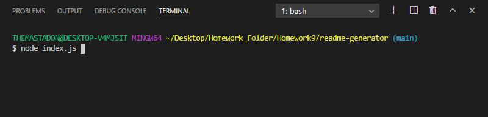
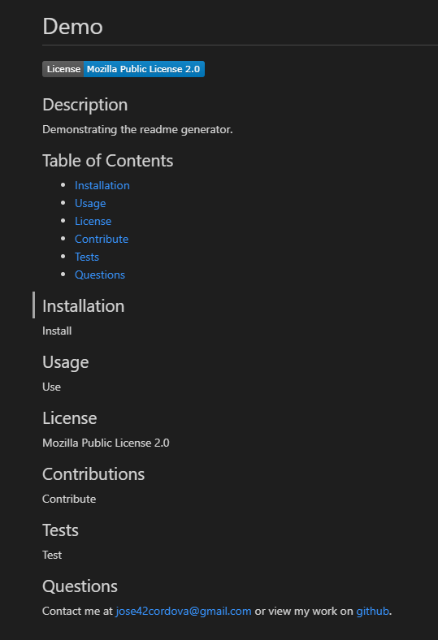

# README Generator

## Description

This is an application using the command line to generate README markdown files. The user is prompted with a series of questions, and the answers to those questions fill in sections of the README file. Once the prompts are completed, the README file is generated in the output folder.

## Usage

Just enter `node index.js` in the command line and follow the prompts.

## License

## Credits

[Node.js](https://nodejs.org/en/)

[Inquirer.js](https://www.npmjs.com/package/inquirer)